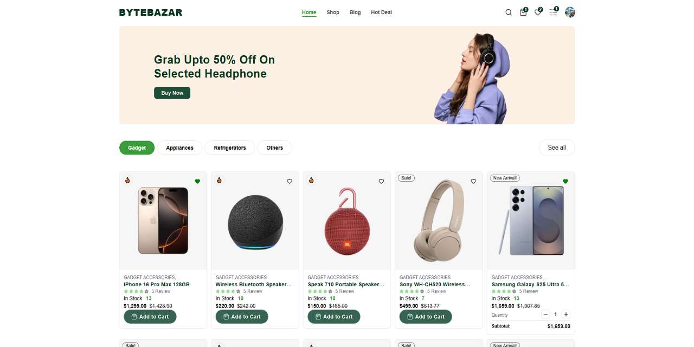
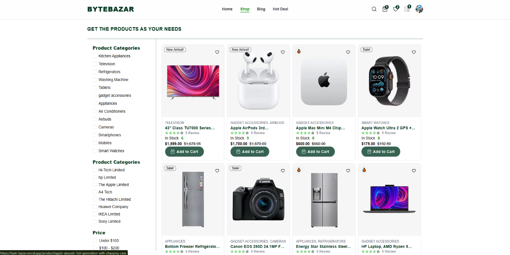
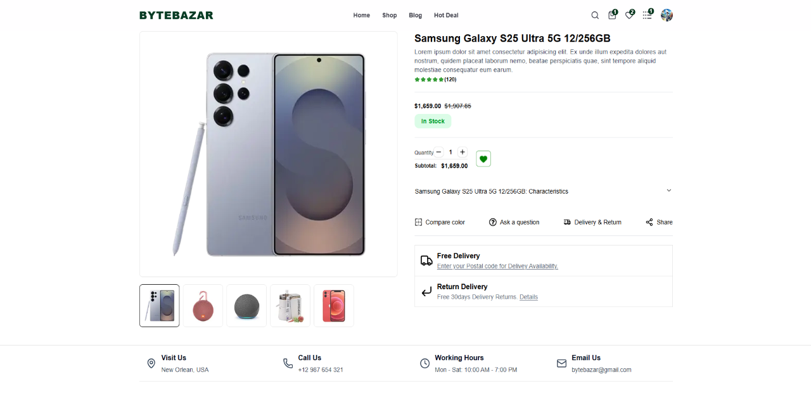
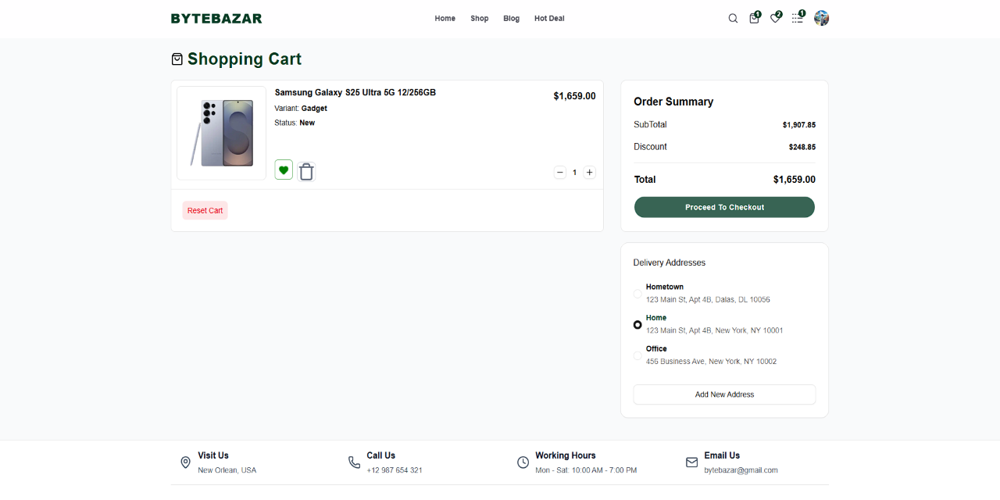
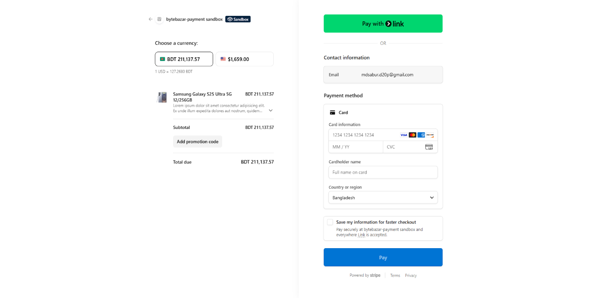
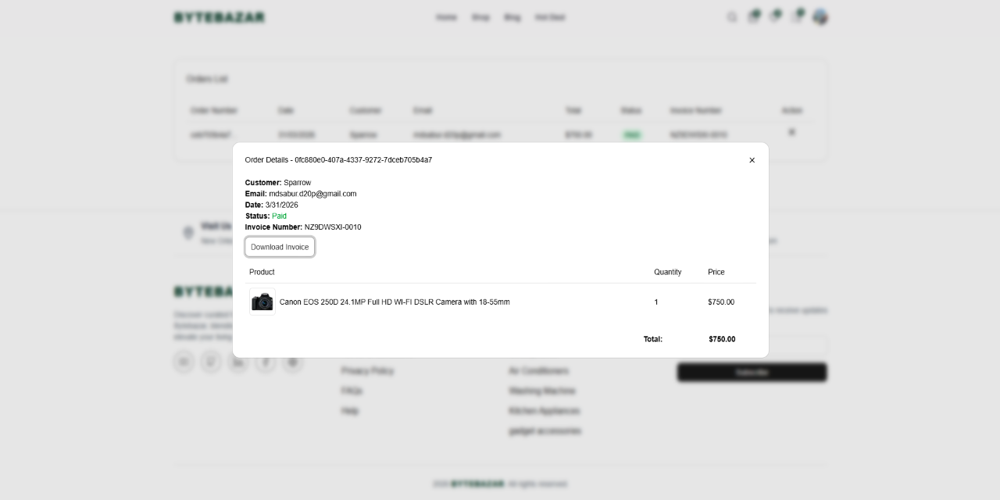
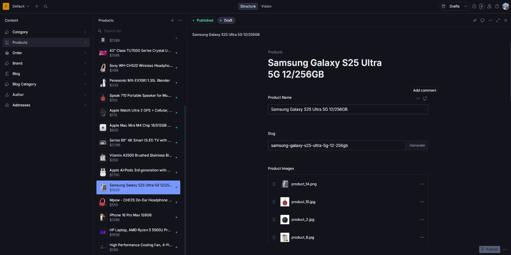

# 🛒 ByteBazar | Next.js E-Commerce (Clone - Learning-Project)

This is a **modern, high-performance E-Commerce application** built as a deep-dive learning project. It focuses on the latest features of **Next.js 15**, **Server Actions**, and **Headless CMS integration**.

I developed this project by following a professional-grade tutorial to master building scalable, production-ready web applications with a focus on **Type Safety** and **Server-side Rendering**.

---

## 🔗 Live Experience

🚀 **Deployed on Vercel:** [Visit ByteBazar](https://byte-bazar.vercel.app/)

---

## 🧠 What I Learned

This project was a major milestone in my development journey. Key takeaways include:

- **Next.js 15 App Router:** Implementing nested layouts, loading states, and error boundaries.
- **Clerk Authentication:** Handling secure user sessions, protected routes, and synced user metadata.
- **Stripe Integration:** Managing secure checkout flows and handling asynchronous events.
- **State Management:** Using **Zustand** for a lightweight, reactive shopping cart experience.

---

## 📸 Screenshots

### 🏠 Home Page

<p align="center">
  
</p>

### 🛍️ Product Pages

<p align="center">
  
</p>

### 📄 Product Details

<p align="center">
  
</p>

### 🛒 Cart & Checkout

<p align="center">
  
</p>

<p align="center">
  
</p>

### 📦 Orders

<p align="center">
  
</p>

### 🛠️ Admin (Sanity Studio)

<p align="center">
  
</p>

---

## 🛠️ Tech Stack

### Core Frameworks

- **Framework:** [Next.js](https://nextjs.org/) (App Router)
- **Auth:** [Clerk](https://clerk.com/) (User Management)
- **Database/CMS:** [Sanity.io](https://www.sanity.io/)
- **Payments:** [Stripe API](https://stripe.com/)

### Frontend & Styling

- **Styling:** Tailwind CSS
- **UI Components:** Shadcn/UI & Radix UI
- **State Management:** Zustand
- **Icons:** Lucide React

---

## 🧩 Core Features

- **⚡ Real-time Product Management:** Instant updates using Sanity Live Content API.
- **🔐 Advanced Auth:** Secure login/signup including Webhooks to sync users.
- **🛍️ Dynamic Cart:** Persistent shopping cart with real-time stock/price calculations.
- **💳 Stripe Checkout:** Fully integrated payment gateway with success/cancel redirection.
- **📦 Order Tracking:** A dedicated orders page for users to view their purchase history.
- **🎨 Responsive Design:** Optimized for mobile, tablet, and desktop views.
- **🏗️ Sanity Studio:** A custom-built admin dashboard at `/studio` for managing the store's inventory.

---

## 🚀 Local Setup

1.  **Clone the repo:**

    ```bash
    git clone https://github.com/gitbugd20p/ByteBazar.git
    cd ByteBazar
    ```

2.  **Install dependencies:**

    ```bash
    npm install
    ```

3.  **Environment Variables:**
    Create a `.env` file and add your keys:

    ```env
    NEXT_PUBLIC_CLERK_PUBLISHABLE_KEY=
    CLERK_SECRET_KEY=
    NEXT_PUBLIC_SANITY_PROJECT_ID=
    NEXT_PUBLIC_SANITY_DATASET=
    STRIPE_SECRET_KEY=
    STRIPE_WEBHOOK_SECRET=
    NEXT_PUBLIC_BASE_URL=http://localhost:3000
    ```

4.  **Run development server:**

    ```bash
    npm run dev
    ```

---

## 👤 Author

- **Project Tutorial Credit:** Based on the [ReactBD](https://www.youtube.com/@reactjsBD) Build a Full Stack E-Commerce Project.

---
